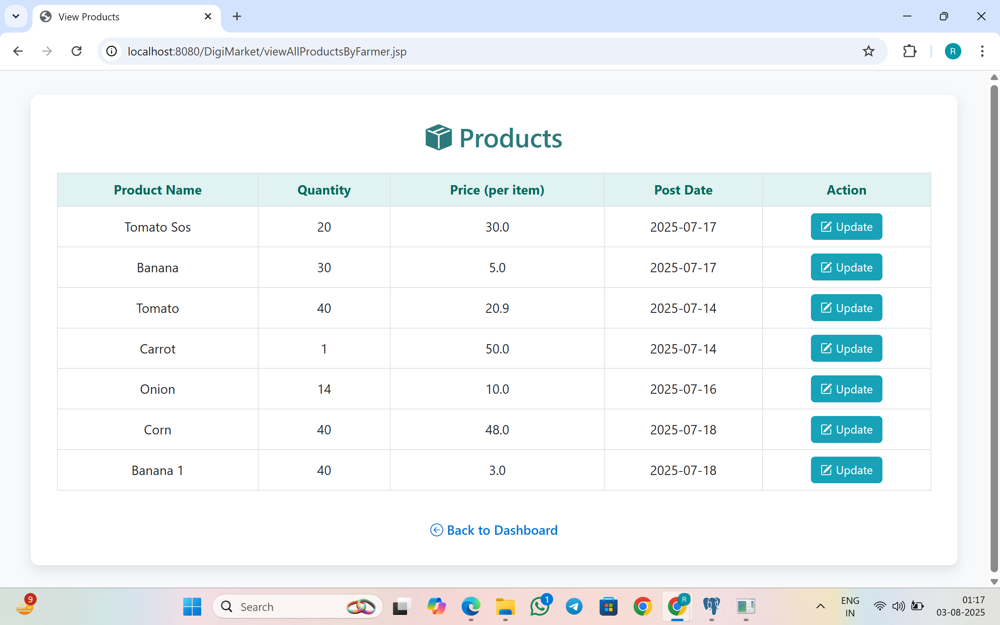

# 🌾 DigiMarket: Farmer to Consumer Marketplace

DigiMarket is a full-stack Java-based web application designed to connect **farmers directly with consumers**, eliminating the need for middlemen and ensuring better prices for both parties. The platform supports **role-based access** for Farmers, Buyers, and Admins.

---

## 📌 Features

### 👨‍🌾 Farmer
- Register & Login
- Add/Edit/Delete product listings
- View/Confirm/Decline orders placed by buyers
- Change password

### 🛒 Buyer
- Register & Login
- Browse available products & place orders
- View order status (pending, confirm, decline)
- Change password

### 🛡️ Admin
- Add/Delete farmer
- Monitor products and buyers

---

## 🛠️ Tech Stack

| Layer       | Technologies                       |
|-------------|------------------------------------|
| Backend     | Java, JSP, Servlets, JDBC          |
| Frontend    | HTML, CSS, JavaScript, Bootstrap   |
| Database    | PostgreSQL                         |
| Server      | Apache Tomcat                      |
| Tools       | Eclipse / IntelliJ, pgAdmin        |

---

## 📁 Project Structure

```

DigiMarket/
├── src/
│   └── com.rohit.\* (Servlets, Model, DBConnect)
├── WebContent/ or webapp/
│   ├── JSP files
└── README.md

````

---

## ⚙️ Setup Instructions

### 🔧 Prerequisites:
- Java JDK 8+
- PostgreSQL
- Apache Tomcat (v7+)
- Eclipse or IntelliJ IDE

### 🧪 Steps:

1. **Clone the repository**
   ```bash
   git clone https://github.com/rohitbari/DigiMarket-Farmer-To-Consumer.git
````

2. **Import the project** into your IDE as a Dynamic Web Project.

3. **Set up the PostgreSQL database**

   * Create a new database: `marketDB`
   * Run the SQL script in `marketDB.sql`
   * Update DB credentials in your `DBConnection.java`

4. **Deploy to Tomcat**

   * Add project to Tomcat server
   * Start server and access: `http://localhost:8080/DigiMarket/`

---

## 📸 Screenshots 

```





```
---

## 📂 SQL File (Database Schema)

Included SQL script: `marketDB.sql`

Creates tables:

* `buyers` (id, name, contact, address, email, password)
* `farmers` (id, name, location, contact, email, password)
* `products` (id, name, price, quantity, farmer_id, post_date)
* `orders` (id, product_id, buyer_id, quantity, order_date, status)

---

## 👨‍💻 Author

**Rohit Bari**
Java Developer | Full-Stack Web Development Enthusiast
[GitHub]([[https://github.com/your-username](https://github.com/rohitbari)]) • [LinkedIn]([https://linkedin.com/in/your-profile](https://www.linkedin.com/in/rohit-bari-7628b6257/))

```

---


